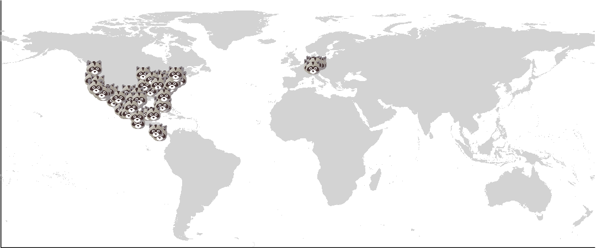
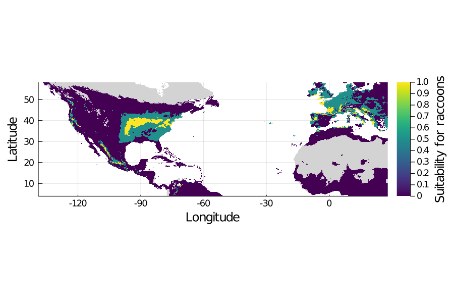

## PL_FFYM Experience
#### Contributors:

- Gracielle  
- Norma  
- Francis
- Gabriel
- Timothée  

### Outline

    1. We want to know where species are  
    2. We can do that using our computers: you can find them from home!  
    3. Understand species requirements  
    4. How computers learn about species requirements  
    5. Our results  
    6. Take home message (we can find species using computers YAY)  

### Main text
Have you ever noticed how when we travel to a place far away, we stop seeing animals we usually see back home?  
Or when that biologist on TV goes to a place that is really far from where you live, she shows a lot of birds, mammals, and plants you have never seen before?  
And how do we know where we can find those animals and plants?  

We could try to explore every corner on Earth and list all living creatures that are present in each spot.
Scientists used to understand nature doing things like that. We still want to know where all living creatures are, but that was tremendous work to go all around the world sampling everything.  
It turns out that ecologists can now use computers to answer these questions without having to leave their labs, and you can do that too!  

Imagine you want to know how far you should go to find a raccoon. You first need to know a little bit about them, like where they live and what they like to eat.  
So you look them up and find a couple of information:  

Their mating season happens around January and lasts approximately two months, after which the female gives birth to her offspring (4-6 cubs).  
Then, when you see groups of raccoons, it sure is a family taking a walk.  
At 10 months old, the baby raccoons will be independent and will prefer to do things their own way, hunting their own food and choosing a new place to live.  
But how do raccoons choose their den?  
Biologists discovered that raccoons usually select a wooded area near to a water source, but any quiet place with food and water can be a den.  
And what about dinner?  
Their front legs are very sensitive, which is a very useful tool to discover what is on the menu when you have an **omnivorous** diet, which means they eat plants, insects, frogs, eggs, and rodents (such as rats).  
With such a varied diet, they can take advantage of us, humans, because we are also omnivorous and we waste a lot of food.  
Thus, raccoons can have a feast only using what we throw in the garbage every day!  
Now imagine that there are biologists all around the world communicating this information; it is a large amount of **data**, right?  
But all this information tells us a lot about where we have higher chances of finding a raccoon: we can find them where there are trees, food (even garbage!) and water, and we can find more of them in the beginning of the year.  
Here is when we need computers to help us analyze the data and find the **species**.

When we ask computers to help us find raccoons, we share with them what we already know about those animals, and then computers understand how the environment should be in order to host a raccoon.  
Then we can show the computer a different environment, and it will tell us how likely it is that we find a raccoon there based on the characteristics of this particular environment.  
Once a computer has learned all about what we told it, it will think for a while.  
But how do computers think?  
They use something we call an **algorithm**, which is a sequence of orders they follow to reach a given answer.  
We may not realize it, but we all take decisions on a daily basis in a similar way as computers do.
For example, when we have to go outside, we have to decide what we should wear.  
So we gather some information, such as which clean clothes are available and if it’s raining or not.  
The following step would be to exclude options based on this information using a sequence of statements: if it’s raining, we'll wear a jacket and boots; if it’s not raining, we’ll wear a t-shirt.  
If it’s raining, but the jacket is not clean… Well, you can either use a dirty jacket or stay home!

Computers can apply the same logic to our raccoon problem: if it’s too cold and snowy, or too hot and dry, raccoons will probably not be there.  
If there’s no food they can eat, they will probably not be there either.  
On the contrary, if there is a temperate forest, where the temperature is neither too cold nor too hot, and if there is enough clean water for them to drink, they might be present, hidden somewhere in the woods.  
They might also be present if there is a city or a village with lots of food for them to eat.  
Who wouldn't be attracted to this trash buffet?

After running the algorithm, computers display a bunch of numbers (like **probabilities**) on the screen.  
According to the information we have provided them, they calculated a unique number, between 0 and 1, for every place in the world.  
If this number is low, you might not be able to find a raccoon there.  
However, if this number is high, a raccoon might be hiding there somewhere.  
What's great with computers is that we can use these numbers to make beautiful maps!

We made one such map using two types of information: the precise location where some raccoons have been observed in the past, along with details on these
locations.
These details were the location's temperature, its total precipitations, and whether or not it has trees, water, and urban places (meaning garbage!).
Our first map looked like this:

From this map, our computers learned about the characteristics of a suitable habitat for a raccoon, in terms of temperature, precipitation, trees, water, and garbage.
Then we asked our computers to look in the whole world and to tell us the chances that we find a raccoon in each place, so it thought really hard for a while...
The computer then attributed values between 0 and 1 for each place, representing how high is the probability to find a raccoon there.  
Regions with similar characteristics as the ones where raccoons had previously been found had a high value, but regions with unsuitable characteristics had low values.  
Remember that regions with a high value, near 1, might contain a raccoon and that regions with a low value, near 0, might not contain any.  
The computer then answered our question with another map, like this one:

See? The computer helped us find where we should go first if we want to find a raccoon!  
If the place has a high value, we should go there first because the chances are very high that we would find a raccoon there.  
Notice that sometimes the computer says that we should go to places where raccoons knowingly are not.  
There are ways to help computers avoid making these mistakes, and this is why it is so important that humans validate computers' answers and use them only to guide our searches.  
Because the world is changing, raccoons will constantly be moving and adapting to new places, making computers' jobs even more valuable.  
Having a common language with computers allows us to organize, to quantify, and to understand what would be an ideal place to find a raccoon now, but also in a near future.    

One of the many advantages of applying computer science into biology is that it lets you look for all living creatures (and even *non living* things!) other than raccoons. For example, if you want to look for another kind of animal that behaves just like raccoons, maybe your maps will show you where opossums live!
Opossums belong to another species, but also have an **omnivorous** diet, nocturnal habits and the cubs stay with their mother during their first months of life. Even with these similarities, the ancestors of raccoons and opossums come from different regions, leaving their populations in locations in the world that do not always coincide. 

But why can we not find raccoons and opossums everywhere if they are adaptable to many kinds of places? Animal species could arrive to places that have all the conditions to be a new home by many reasons, maybe because the environment has changed or because humans make it easier for them to move there... On the other hand, it is not because a place is great to live that we want to move: these places are not good enough if our friends and family are not there.  
Sometimes, when plants and animals move to a new place and their old friends are not with them, they can become a huge problem, and then we call them _invasive species_. They can reproduce too much, eat other species too much, or make another species reproduce too much as well. The kind of maps we did help us stay alert about where species could move and prevent them from establishing there if needed, or even cautiously move them there if they are about to go extinct.

Now it is your turn to be a scientist!  
Locate where you live in the world and see if it would be easy for you to find a raccoon there.  
Help us validate our computer's answer by verifying if raccoons indeed live where we said they might be!  
Does the map say there might be a raccoon near your house but there’s no way to find a raccoon there?  
In your opinion, how could we have made the map more realistic?

### Glossary:

**Algorithm**: A specific procedure for solving a well-defined computational problem.

**Data**: Encoded information that can be used to answer specific questions.

**Omnivorous**: Species that can eat plants and meat.

**Probability**: Numerical measure of the likelihood that a particular event will occur.

**Species**: A group of organisms that share common characteristics and are capable of interbreeding.

### References:

Louppe, V., Leroy, B., Herrel, A. et al. Current and future climatic regions favourable for a globally introduced wild carnivore, the raccoon Procyon lotor. Sci Rep 9, 9174 (2019). https://doi.org/10.1038/s41598-019-45713-y

Species Distribution Modelling: Contrasting presence-only models with plot abundance data; Gomes, V.H., IJff, S.D., Raes, N. et al. Species Distribution Modelling: Contrasting presence-only models with plot abundance data. Sci Rep 8, 1003 (2018). https://doi.org/10.1038/s41598-017-18927-1

Suzanne Prange, Stanley D. Gehrt, Ernie P. Wiggers, Influences of Anthropogenic Resources on Raccoon (Procyon lotor) Movements and Spatial Distribution, Journal of Mammalogy, Volume 85, Issue 3, June 2004, Pages 483–490, https://doi.org/10.1644/1383946
